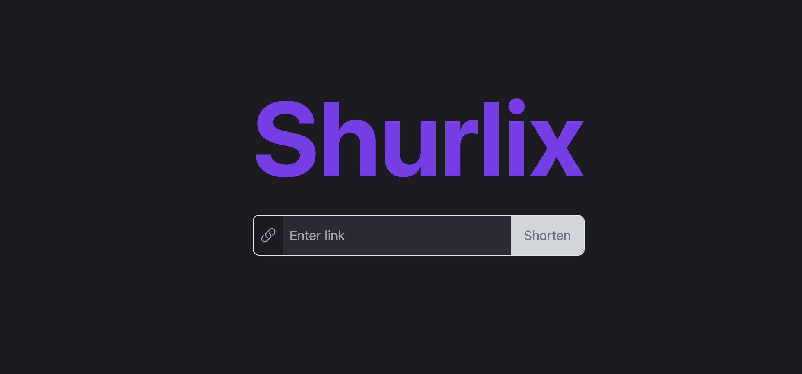

<!-- Improved compatibility of back to top link: See: https://github.com/othneildrew/Best-README-Template/pull/73 -->
<a id="readme-top"></a>
<!--
*** Thanks for checking out the Best-README-Template. If you have a suggestion
*** that would make this better, please fork the repo and create a pull request
*** or simply open an issue with the tag "enhancement".
*** Don't forget to give the project a star!
*** Thanks again! Now go create something AMAZING! :D
-->


<!-- PROJECT SHIELDS -->
<!--
*** I'm using markdown "reference style" links for readability.
*** Reference links are enclosed in brackets [ ] instead of parentheses ( ).
*** See the bottom of this document for the declaration of the reference variables
*** for contributors-url, forks-url, etc. This is an optional, concise syntax you may use.
*** https://www.markdownguide.org/basic-syntax/#reference-style-links
-->
[![Contributors][contributors-shield]][contributors-url]
[![Forks][forks-shield]][forks-url]
[![Stargazers][stars-shield]][stars-url]
[![Issues][issues-shield]][issues-url]
[![MIT License][license-shield]][license-url]
[![LinkedIn][linkedin-shield]][linkedin-url]


<!-- PROJECT LOGO -->
<br />
<div align="center">
  <a href="https://github.com/DiscordDungeons/Shurlix">
    
  </a>

  <p align="center">
    A simple but awesome URL Shortener
    <br />
    <a href="https://github.com/DiscordDungeons/Shurlix"><strong>Explore the docs »</strong></a>
    <br />
    <br />
    <a href="https://github.com/DiscordDungeons/Shurlix">View Demo</a>
    ·
    <a href="https://github.com/DiscordDungeons/Shurlix/issues/new?labels=bug&template=bug-report---.md">Report Bug</a>
    ·
    <a href="https://github.com/DiscordDungeons/Shurlix/issues/new?labels=enhancement&template=feature-request---.md">Request Feature</a>
  </p>
</div>


<!-- TABLE OF CONTENTS -->
<details>
  <summary>Table of Contents</summary>
  <ol>
    <li>
      <a href="#about-the-project">About The Project</a>
    </li>
    <li>
      <a href="#getting-started">Getting Started</a>
      <ul>
        <li><a href="#prerequisites">Prerequisites</a></li>
        <li><a href="#installation">Installation</a></li>
      </ul>
    </li>
    <li><a href="#usage">Usage</a></li>
    <li><a href="#roadmap">Roadmap</a></li>
    <li><a href="#contributing">Contributing</a></li>
    <li><a href="#license">License</a></li>
    <li><a href="#contact">Contact</a></li>
  </ol>
</details>


<!-- ABOUT THE PROJECT -->
## About The Project



Shurlix is a high-performance URL shortener built with Rust, designed for fast link shortening, custom slugs, and secure link management. Shurlix includes user authentication, link analytics*, and an easy-to-use API for seamless integration.

\* Yet to be implemented.

### Features

- Custom Slugs: Create memorable, custom short links.
- Authentication: Secure your short links with user-based access.
- Link Analytics*: Track link usage statistics.

\* Yet to be implemented.

### Project Structure

- Frontend: Built with Preact, focusing on lightweight and fast performance.
- Backend: Powered by Axum and Diesel for efficient data handling and API responses.
- Database: PostgreSQL is used to manage user data and link storage.
- Authentication: Session tokens are used for secure user identification.


<p align="right">(<a href="#readme-top">back to top</a>)</p>


<!-- GETTING STARTED -->
## Getting Started

### Prerequisites

- Rust (latest stable version)
- NodeJS
- PostgreSQL (configured database for Shurlix)
- Docker (optional, for containerized deployment)

### Installation

1. Clone the repository:
    ```bash
    git clone https://github.com/DiscordDungeons/Shurlix.git
    cd Shurlix
    ```
2. Environment Configuration

    Create a .env file in the root directory to manage configuration details for the application. Use the provided .env.example as a template:

    ```bash
    cp .env.example .env
    ```
3. Database Setup
    1. Navigate to the crates/db directory, where migrations and database configurations are managed:
        ```bash
        cd crates/db
        ```
    2. Install Diesel CLI if you haven’t already:
        ```bash
        cargo install diesel_cli --no-default-features --features postgres
        ```
    3. Run the database migrations to set up the tables and initial schema:
        ```bash
        diesel migration run
        ```
    4. Once migrations are complete, navigate back to the project root:
        ```bash
        cd ../../
        ```
4. Frontend Setup
    1. Move to the crates/frontend directory, where the Preact frontend code resides:
        ```bash
            cd crates/frontend
        ```
    2. Install dependencies using your package manager (e.g., npm or yarn):
        ```bash
        npm install
        # or
        yarn install
        ```
    3. Start the frontend development server:
        ```bash
        npm run dev
        # or
        yarn dev
        ```
    
        The frontend will start on http://localhost:5173 by default.
    4. Return to the root directory after setting up the frontend:
        ```bash
        cd ../../
        ```
5. Starting the Backend

    Now that the environment, database, and frontend are configured, you can start the backend server:

    ```bash
    cargo run
    ```

    The backend server will run on http://localhost:3000 by default.

<p align="right">(<a href="#readme-top">back to top</a>)</p>


<!-- USAGE EXAMPLES -->
## Usage

Use this space to show useful examples of how a project can be used. Additional screenshots, code examples and demos work well in this space. You may also link to more resources.

_For more examples, please refer to the [Documentation](https://example.com)_

<p align="right">(<a href="#readme-top">back to top</a>)</p>


<!-- ROADMAP -->
## Roadmap

- [x] Proper readme
- [ ] Proper docs
- [ ] User interface
    - [x] Login / Create user
        - [x] Email verification
        - [ ] 2fa
    - [x] Enable / Disable user creation
    - [ ] Dashboard
        - [x] Links dashboard (overview, deletion, etc)
        - [x] User settings
            - [x] Update email & username
            - [x] Change password
            - [x] Delete account
    - [ ] Initial setup flow
      - [ ] Add admin account
      - [ ] Setup first domain
      - [ ] Check settings (maybe move them into db?)
- [x] Enable / Disable anonymous shortening
- [ ] API
    - [ ] Links
        - [x] Handle multiple urls
        - [x] Create links
        - [ ] Read links
            - [ ] By user
            - [ ] All   
                - [ ] As admin
                - [x] As user
        - [ ] Delete links
            - [x] As user
            - [ ] As admin

See the [open issues](https://github.com/DiscordDungeons/Shurlix/issues) for a full list of proposed features (and known issues).

<p align="right">(<a href="#readme-top">back to top</a>)</p>


<!-- CONTRIBUTING -->
## Contributing

Contributions are what make the open source community such an amazing place to learn, inspire, and create. Any contributions you make are **greatly appreciated**.

If you have a suggestion that would make this better, please fork the repo and create a pull request. You can also simply open an issue with the tag "enhancement".
Don't forget to give the project a star! Thanks again!

1. Fork the Project
2. Create your Feature Branch (`git checkout -b feature/AmazingFeature`)
3. Commit your Changes (`git commit -m 'Add some AmazingFeature'`)
4. Push to the Branch (`git push origin feature/AmazingFeature`)
5. Open a Pull Request

<p align="right">(<a href="#readme-top">back to top</a>)</p>

### Top contributors:

<a href="https://github.com/DiscordDungeons/Shurlix/graphs/contributors">
  
</a>


<!-- LICENSE -->
## License

Distributed under the MIT License. See `LICENSE` for more information.

<p align="right">(<a href="#readme-top">back to top</a>)</p>


<!-- CONTACT -->
## Contact

Project Link: [https://github.com/DiscordDungeons/Shurlix](https://github.com/DiscordDungeons/Shurlix)

<p align="right">(<a href="#readme-top">back to top</a>)</p>


<!-- MARKDOWN LINKS & IMAGES -->
<!-- https://www.markdownguide.org/basic-syntax/#reference-style-links -->
[contributors-shield]: https://img.shields.io/github/contributors/DiscordDungeons/Shurlix.svg?style=for-the-badge
[contributors-url]: https://github.com/DiscordDungeons/Shurlix/graphs/contributors
[forks-shield]: https://img.shields.io/github/forks/DiscordDungeons/Shurlix.svg?style=for-the-badge
[forks-url]: https://github.com/DiscordDungeons/Shurlix/network/members
[stars-shield]: https://img.shields.io/github/stars/DiscordDungeons/Shurlix.svg?style=for-the-badge
[stars-url]: https://github.com/DiscordDungeons/Shurlix/stargazers
[issues-shield]: https://img.shields.io/github/issues/DiscordDungeons/Shurlix.svg?style=for-the-badge
[issues-url]: https://github.com/DiscordDungeons/Shurlix/issues
[license-shield]: https://img.shields.io/github/license/DiscordDungeons/Shurlix.svg?style=for-the-badge
[license-url]: https://github.com/DiscordDungeons/Shurlix/blob/master/LICENSE.txt
[linkedin-shield]: https://img.shields.io/badge/-LinkedIn-black.svg?style=for-the-badge&logo=linkedin&colorB=555
[linkedin-url]: https://linkedin.com/in/linkedin_username
[product-screenshot]: images/screenshot.png
[Next.js]: https://img.shields.io/badge/next.js-000000?style=for-the-badge&logo=nextdotjs&logoColor=white
[Next-url]: https://nextjs.org/
[React.js]: https://img.shields.io/badge/React-20232A?style=for-the-badge&logo=react&logoColor=61DAFB
[React-url]: https://reactjs.org/
[Vue.js]: https://img.shields.io/badge/Vue.js-35495E?style=for-the-badge&logo=vuedotjs&logoColor=4FC08D
[Vue-url]: https://vuejs.org/
[Angular.io]: https://img.shields.io/badge/Angular-DD0031?style=for-the-badge&logo=angular&logoColor=white
[Angular-url]: https://angular.io/
[Svelte.dev]: https://img.shields.io/badge/Svelte-4A4A55?style=for-the-badge&logo=svelte&logoColor=FF3E00
[Svelte-url]: https://svelte.dev/
[Laravel.com]: https://img.shields.io/badge/Laravel-FF2D20?style=for-the-badge&logo=laravel&logoColor=white
[Laravel-url]: https://laravel.com
[Bootstrap.com]: https://img.shields.io/badge/Bootstrap-563D7C?style=for-the-badge&logo=bootstrap&logoColor=white
[Bootstrap-url]: https://getbootstrap.com
[JQuery.com]: https://img.shields.io/badge/jQuery-0769AD?style=for-the-badge&logo=jquery&logoColor=white
[JQuery-url]: https://jquery.com 
